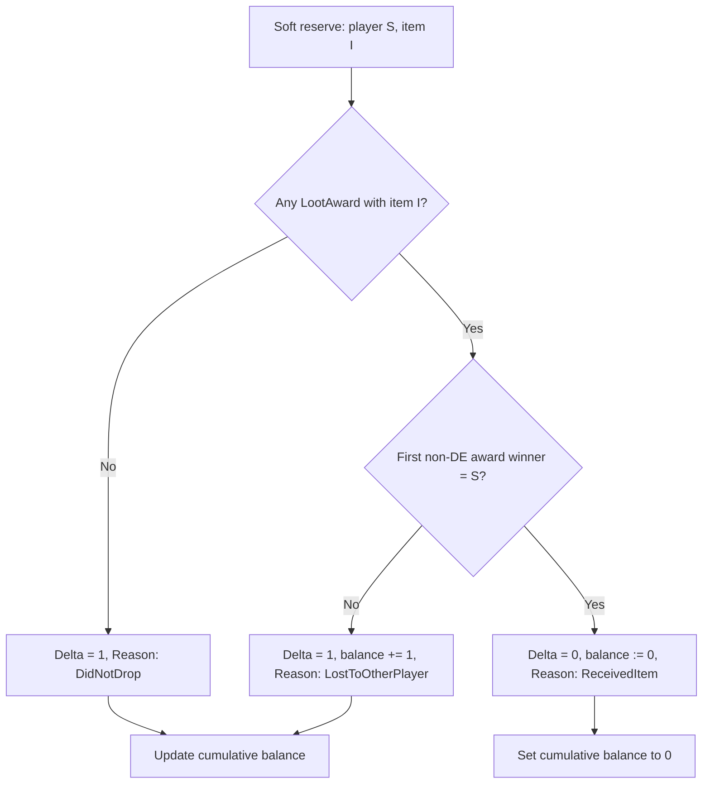

# +1 Logic

Rules for the guild soft reserve priority system. Implemented in `PlusOneCalculator`; persisted by `RaidImportService.RecalculatePlusOneAsync()`.

Independent from Softres.it's own `Plus` column (ignored by the parser).

## Scope

| Rule | Value |
|------|-------|
| Applies to | **Reserved items only** (`SoftReserve` rows per session) |
| Item scope | **Global per `ItemId`** (SSC + TK shared) |
| Roster scope | **Per roster** (no cross-roster tracking) |
| Accumulation | **+1, +2, +3, …** across sessions/weeks |
| On receive | Balance **resets to 0** (row removed from `PlusOneBalances`) |

## Per-session evaluation

For each **soft reserve** (player `S`, item `I`) in a raid session, exactly **one** evaluation is performed:



### Drop detection

An item **dropped** if the session has at least one `LootAward` with that `ItemId`, including disenchant (`IsDisenchanted = true`).

### Winner detection (as implemented)

`PlusOneCalculator` groups loot by `ItemId`, then takes the **first** award where `WinnerPlayerId` is set and `IsDisenchanted` is false.

Player **received** the item if that award's `WinnerPlayerId` equals the reserver's `PlayerId`.

`AwardedToPlayerId` on `SessionReservationResult` is set from this first qualifying winner (if any).

### Duplicate drops (same item, same session)

Gargul may record **multiple** `LootAward` rows for the same `ItemId` (e.g. duplicate tokens). The calculator still evaluates each soft reserve **once per session**. Which award “wins” for the receive check depends on the **first non-disenchant award** in the loot list order (insert/JSON order).

There is **no separate +1 delta per duplicate drop** for the same reservation.

### Disenchant

If all awards for an item are disenchanted, there is no qualifying winner → treated as dropped, reserver gets **+1** (`LostToOtherPlayer` if other awards existed, otherwise same delta with drop detected).

## Cumulative calculation

Sessions are processed **chronologically** (`SessionDate`, then `RaidSessionId`):

```
balance(S, I) = 0  // in-memory for recalc

for each session in order:
  for each soft reserve (S, I) in session:
    apply session rules above
    append SessionReservationResult row
```

After all sessions, only balances **> 0** are written to `PlusOneBalances`.

## Views vs stored data

| View | Filter |
|------|--------|
| Player overview | `PlusOneBalance.CurrentCount > 0` only |
| Item overview | All `(player, item)` balance rows; adds `HasReceived` from historical `LootAward` data |
| Session detail | All `SessionReservationResult` for that session + current cumulative +1 lookup |

## What is NOT counted

- Items the player did **not** soft reserve in that session
- Softres.it `Plus` column
- Gargul `plusOneState` (informational during rolls only)

Loot for players not in the softres export may still create `LootAward` / `Player` rows but does not create +1 deltas without a matching `SoftReserve`.

## Reason enum

| `PlusOneReason` | Meaning |
|-----------------|---------|
| `DidNotDrop` | Item did not drop this session |
| `LostToOtherPlayer` | Item dropped, reserver did not receive (other winner or disenchant) |
| `ReceivedItem` | Reserver received the item → balance reset |

Displayed as enum name in session/week views (not localized).

## Priority usage (in raid)

This app **tracks** +1 standings. Actual in-raid priority (before rolls) is handled by the raid leader / Gargul. Gargul's `plusOneState` reflects what was used during rolls; the app maintains its **own** ledger from imports.
