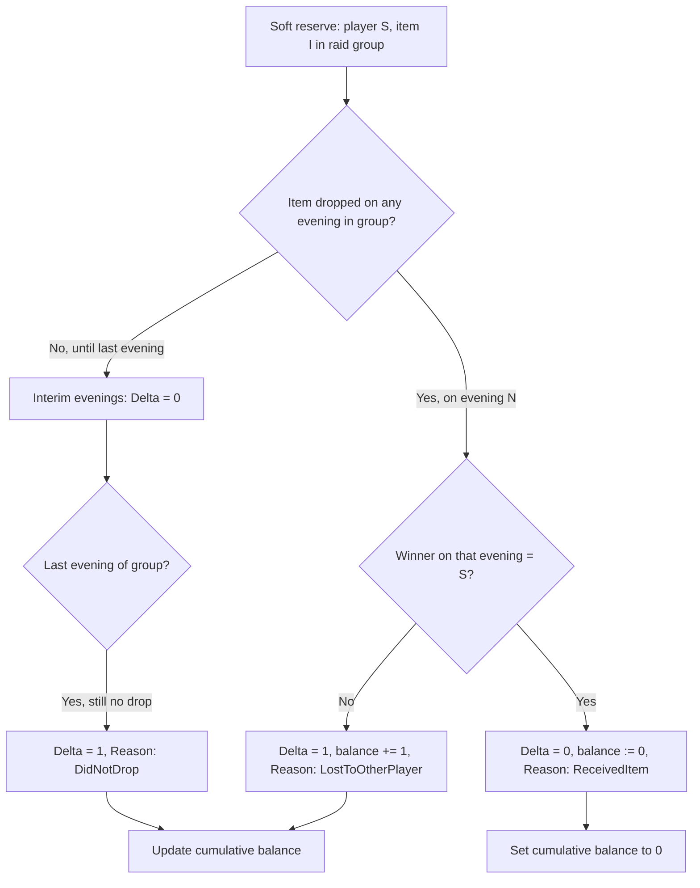

# +1 Logic

Rules for the guild soft reserve priority system. Implemented in `PlusOneCalculator`; persisted by `RaidImportService.RecalculatePlusOneAsync()`.

Independent from Softres.it's own `Plus` column (ignored by the parser).

## Scope

| Rule | Value |
|------|-------|
| Applies to | **Reserved items only** (`SoftReserve` rows per session) |
| Item scope | **Global per `ItemId`** (SSC + TK shared) |
| Roster scope | **Per roster** (no cross-roster tracking) |
| Evaluation unit | **Once per Raid-ID** (`RaidWeek` + same Gargul `softresID`), not per raid evening |
| Accumulation | **+1, +2, +3, …** across raid IDs / weeks |
| On receive | Balance **resets to 0** (row removed from `PlusOneBalances`) |

## Per Raid-ID evaluation (same `softresID` within one raid week)

Softres.it uses **one reservation list per raid ID**. The tracker mirrors that: all `RaidSession` rows with the **same `SoftresId` in the same `RaidWeek`** form one evaluation group (e.g. TK continued on 15.05 and 17.05).

For each **soft reserve** (player `S`, item `I`) in that group, exactly **one +1 delta** is applied for the whole raid ID:



### Multi-evening behaviour

| Evening | Item dropped? | +1 delta | Notes |
|---------|---------------|----------|-------|
| 1st (not last) | No | **0** | Reservation still active; reason may show `DidNotDrop` for that night |
| 2nd (last) | No | **+1** | Single delta for the whole raid ID |
| 1st | Yes, lost | **+1** | Resolved immediately; carry-forward evenings show delta **0** |
| 2nd (last) | Yes, lost | **+1** | Only if item had not dropped on an earlier evening |

Sessions **without** a shared `softresID` (or loot-only sessions) are evaluated **alone** within their raid week.

### Drop detection

An item **dropped** on an evening if **that session's** `LootAward` list contains the `ItemId`, including disenchant (`IsDisenchanted = true`).

Evaluation runs when the item drops on the current evening, or on the **last session date** of the group if it never dropped.

### Winner detection (as implemented)

When the item drops on an evening, `PlusOneCalculator` takes the **first** award for that item in **that session** where `WinnerPlayerId` is set and `IsDisenchanted` is false.

Player **received** the item if that award's `WinnerPlayerId` equals the reserver's `PlayerId`.

`AwardedToPlayerId` on `SessionReservationResult` is set from this first qualifying winner (if any).

### Duplicate drops (same item, same session)

Gargul may record **multiple** `LootAward` rows for the same `ItemId` (e.g. duplicate tokens). The calculator still evaluates each soft reserve **once per raid group**. Which award “wins” for the receive check depends on the **first non-disenchant award** in that session's loot list order (insert/JSON order).

There is **no separate +1 delta per duplicate drop** for the same reservation.

### Disenchant

If all awards for an item on the drop evening are disenchanted, there is no qualifying winner → treated as dropped, reserver gets **+1** (`LostToOtherPlayer` if other awards existed, otherwise same delta with drop detected).

## Cumulative calculation

Raid weeks are processed **chronologically** (`RaidWeek.PeriodStart`). Within each week, groups are processed by earliest session date:

```
balance(S, I) = 0  // in-memory for recalc

for each raid week in order:
  for each (RaidWeek, softresID) group in week:
    for each session evening in group (chronological):
      for each soft reserve (S, I) in session:
        if (S, I) already resolved in this group: append follow-up row (delta 0)
        else if item dropped this evening: resolve once, apply delta
        else if last evening of group: resolve DidNotDrop, apply delta
        else: interim row (delta 0, item not dropped this evening)
    append SessionReservationResult rows
```

After all weeks, only balances **> 0** are written to `PlusOneBalances`.

## Views vs stored data

| View | Filter |
|------|--------|
| Player overview | `PlusOneBalance.CurrentCount > 0` only |
| Item overview | All `(player, item)` balance rows; adds `HasReceived` from historical `LootAward` data; DataTables search by item and player (not +1 / received / reserved columns) |
| Session detail | All `SessionReservationResult` for that session + current cumulative +1 lookup |

Interim evenings show **+0 delta** until the raid ID is resolved on the last evening or when the item drops.

## What is NOT counted

- Items the player did **not** soft reserve in that raid group
- A **second +1** for the same `(player, item)` on a carry-forward evening after the raid ID was already resolved
- Softres.it `Plus` column
- Gargul `plusOneState` (informational during rolls only)

Loot for players not in the softres export may still create `LootAward` / `Player` rows but does not create +1 deltas without a matching `SoftReserve`.

## Reason enum

| `PlusOneReason` | Meaning |
|-----------------|---------|
| `DidNotDrop` | Item did not drop (this evening, or entire raid ID on last evening) |
| `LostToOtherPlayer` | Item dropped, reserver did not receive (other winner or disenchant) |
| `ReceivedItem` | Reserver received the item → balance reset |

Displayed as enum name in session/week views (not localized).

## Priority usage (in raid)

This app **tracks** +1 standings. Actual in-raid priority (before rolls) is handled by the raid leader / Gargul. Gargul's `plusOneState` reflects what was used during rolls; the app maintains its **own** ledger from imports.
