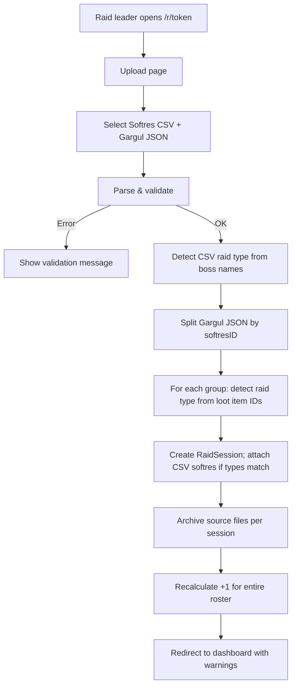

# Workflow

Operational workflow of the Softreserve Tracker, aligned with the current codebase.

## Actors

| Actor | Role |
|-------|------|
| **Raid leader** | Uploads Softres + Gargul exports after raid night |
| **Raiders** | View reservations and +1 standings via shared link |

There is **no login**. Access is controlled by a **secret GUID** per roster (`/r/{token}`). Invalid or unknown tokens return **404** (`RosterAccessFilter`).

## Raid week (Raid-ID)

Raid weeks are **not created manually**. They are derived from import timestamps:

| Rule | Value |
|------|-------|
| Window start | Wednesday **05:00** (server local time) |
| Window end | Next Wednesday **03:00** |
| Week number | Auto-incremented per roster (1, 2, 3, …) |
| Reference time | **Earliest `Date` / reservation time** from the Softres CSV (`SoftresCsvParser`) |

Implementation: `RaidWindowCalculator.GetWindowForDateTime()`.

**Example (May 2026):**

| Export date | Raid-ID |
|-------------|---------|
| 2026-05-15, 17, 19 | **1** (window May 13 05:00 – May 20 03:00) |
| 2026-05-21 | **2** (window May 20 03:00 – May 27 03:00) |

`SessionDate` on each `RaidSession` is the **calendar date** of the earliest CSV reservation (`Min(ReservedAt).Date`), not the raid-week boundary.

## Import workflow

### Step-by-step

1. **Export from Softres.it** → CSV (`Export CSV` on raid page)
2. **Export from Gargul** → JSON (in-game export, `.txt` file)
3. Open roster link → **Upload**
4. Select both files → **Import**
5. Review dashboard, session details, or cumulative overviews

### Parsing details

| Source | Parser | Key fields |
|--------|--------|------------|
| Softres CSV | `SoftresCsvParser` | `ItemId`, `Name`, `From` (boss), `Date`, class/spec/note |
| Gargul JSON | `GargulJsonParser` | `itemID`, `awardedTo`, `softresID`, `timestamp`, `SR` |

If Softres and Gargul session dates differ, a **warning** is shown; the Softres date is used.

### Raid type detection

| Context | Method | Fallback |
|---------|--------|----------|
| Softres CSV | `RaidTypeDetector.DetectFromBosses()` on `From` column | SSC if no boss matches |
| Gargul group | `ItemRaidCatalog.DetectFromItemIds()` on loot in that `softresID` group | SSC if no known item ID |

### Mixed raid evenings

If Gargul contains **multiple `softresID` values** (e.g. SSC + TK same night):

- Each group becomes a **separate `RaidSession`**
- The CSV softres rows are attached **only** to the Gargul group whose **raid type matches** the CSV **and** which has a non-empty **`softresID`**
- Groups **without `softresID`** are **skipped** (warning only; no session created)
- Gargul groups whose **loot date** differs from the paired Softres session date are **skipped**
- If multiple groups match the CSV raid type, the CSV is attached to the group with the **most loot entries**
- Other groups import **loot only** and produce a warning
- The Gargul JSON file is archived on **every** created session; the CSV is archived only on the matching session

### Softres carry-forward

When a Gargul group has the **same `softresID`** as an earlier session but **no new Softres CSV** is attached (e.g. SSC continues on a second evening):

- Softres rows are copied from the **earliest prior session** with that `softresID` and the same raid type
- Items the player **already received** (any prior loot award) are **not** copied
- Duplicate `(PlayerId, ItemId)` pairs are deduplicated
- A warning is shown when carry-forward succeeds or when raid type / prior session mismatches

### Bulk upload pairing

When several exports are uploaded at once, each Softres CSV is paired with a Gargul JSON whose export contains **at least one loot entry on the CSV session date** (`GargulJsonParser.GetSessionDates()`). Multi-date Gargul exports are supported.

### Disenchant (`|de|`)

Gargul awards to `|de|` set `IsDisenchanted = true` and have no winner player. The item still counts as **dropped**. Reservers who did not receive the item get **+1** for that session.

### Player names

- **Softres CSV**: stored as trimmed `Name` from export
- **Gargul**: realm suffix stripped (`Name-Thunderstrike` → `Name`) before lookup/create
- Matching uses `NormalizedName` = lowercase trimmed name per roster

## Routes & views

All roster pages use prefix `/r/{token}`.

| Route | Controller | Purpose |
|-------|------------|---------|
| `/` | `Home` | Create roster |
| `/r/{token}` | `Roster` | Dashboard: raid weeks & sessions |
| `/r/{token}/upload` | `Upload` | Import form (GET/POST) |
| `/r/{token}/sessions/{id}` | `Sessions` | Session detail (+1 delta, reason, cumulative +1) |
| `/r/{token}/weeks/{id}` | `Weeks` | All reservation results in one raid week |
| `/r/{token}/overview/players` | `Overview` | Cumulative +1 by player |
| `/r/{token}/overview/items` | `Overview` | Cumulative +1 by item |
| `/r/{token}/archive` | `Archive` | List uploaded source files |
| `/r/{token}/archive/download/{id}` | `Archive` | Download archived file |
| `/culture/set?culture=de\|en&returnUrl=…` | `Culture` | Set UI language cookie |
| `/debug` | `Debug` | **Dev/testing only:** manage rosters, clear imports |

### Navbar (roster pages)

Order in `_Layout.cshtml`:

1. Dashboard  
2. Spieler / Players  
3. Items  
4. Upload  
5. Archiv / Archive  

Language switch and (in Development only) Debug link are on the right.

### Debug (Development or `Debug:Enabled`)

Available when `ASPNETCORE_ENVIRONMENT=Development` **or** `Debug:Enabled=true` in `appsettings.json`.

| UI | Behaviour |
|----|-----------|
| Navbar link | Shown only in **Development** |
| URL `/debug` | Reachable whenever debug is enabled (including Production with `Debug:Enabled=true`) |

| Action | Effect |
|--------|--------|
| **Clear imports** | Removes raid weeks, sessions, players, +1 data and archived files; keeps the roster and its link |
| **Delete roster** | Removes the roster entirely |

### UI behaviour

| View | DataTables | Notes |
|------|------------|-------|
| Player overview | Yes, `ordering: false` | Only balances with `CurrentCount > 0`; **grouped by player** (name shown once per block) |
| Item overview | Yes | All `(player, item)` balances; **grouped by item**; search by **item** (ID + stored name + Wowhead) and **player name**; includes “received” flag |
| Session / week / archive | Yes | Standard sort/search |

Tables use shared helper `initSoftresDataTable()` (`wwwroot/js/site.js`). Item names are shown via Wowhead tooltips (`Views/Shared/_ItemLink.cshtml`, opens in new tab). In the **item overview**, extra item search terms live in a hidden `.item-search-text` span; the **player column** is searchable by display name. Columns +1, Erhalten/Received, and Reserviert/Reserved are excluded from search. Item column uses `white-space: nowrap` with horizontal scroll if needed.

## Recalculation

After every import, `RaidImportService.RecalculatePlusOneAsync()`:

1. Loads all sessions for the roster (chronological)
2. Runs `PlusOneCalculator.Calculate()`
3. Replaces all `SessionReservationResult` rows for those sessions
4. Replaces all `PlusOneBalance` rows (only stores counts **> 0**)

There is **no delete/re-import UI** in production yet; fixing bad data requires the Development debug page or manual DB work.

## Language & items

| Aspect | Implementation |
|--------|----------------|
| UI strings | `Resources/SharedResource.{resx,de.resx,en.resx}` via `IStringLocalizer<SharedResource>` |
| Default culture | `de` (`Program.cs` → `RequestLocalizationOptions`) |
| Language switch | Navbar dropdown → `CultureController` → cookie |
| Item display | Wowhead tooltip link (icon + localized name); numeric ID only until tooltips load |
| Item links | `de.wowhead.com/tbc/item=…` or `www.wowhead.com/tbc/item=…`, **new tab** |
| Item search names | Stored in `KnownItems` (CSV `Item` column + Gargul `itemLink` on import); backfilled from archive on first item-overview load if missing |
| Softres.it links | Dashboard/session softres ID → `https://softres.it/raid/{id}` (new tab) |
